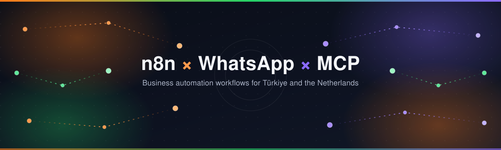
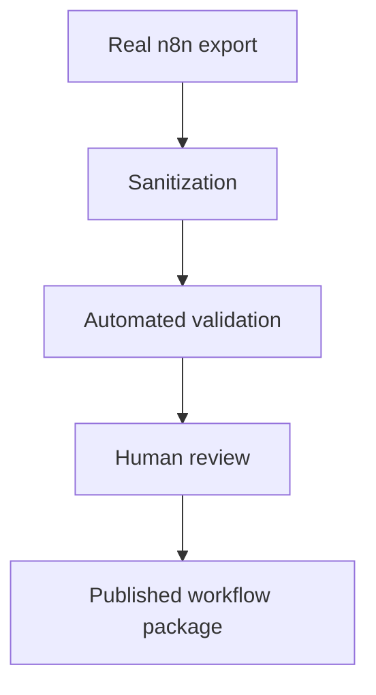

<p align="center">
  
</p>

<h3 align="center">Curated n8n, WhatsApp and MCP automation resources for teams and businesses worldwide.</h3>

<p align="center">
  <a href="LICENSE"></a>
  
  <a href="https://github.com/studivox/awesome-n8n-whatsapp-mcp/actions/workflows/validate.yml"></a>
</p>

<p align="center">
  <a href="#browse-verified-resources">Browse Resources</a> ·
  <a href="#how-workflow-packages-work">Workflow Format</a> ·
  <a href="#contributing">Contribute</a>
</p>

> [!NOTE]
> **Current status:** the curated resource foundation is live, and seven sanitized, tested workflow packages have been published. See [Current status](#current-status) below for exactly what that does and doesn't mean.

---

<details>
<summary><strong>Table of contents</strong></summary>

- [Current status](#current-status)
- [Why this project exists](#why-this-project-exists)
- [What you can find here](#what-you-can-find-here)
- [Browse verified resources](#browse-verified-resources)
- [How workflow packages work](#how-workflow-packages-work)
- [How to use a published workflow](#how-to-use-a-published-workflow)
- [Workflow quality requirements](#workflow-quality-requirements)
- [Available and planned workflows](#available-and-planned-workflows)
- [How validation works](#how-validation-works)
- [Global scope and regional resources](#global-scope-and-regional-resources)
- [Security and privacy](#security-and-privacy)
- [Repository structure](#repository-structure)
- [Contributing](#contributing)
- [Reporting a security issue](#reporting-a-security-issue)
- [Support the project](#support-the-project)
- [License and ownership](#license-and-ownership)

</details>

## Current status

| | |
|---|---|
| ✅ | Curated resource foundation is live: verified official documentation and repositories for n8n, WhatsApp Cloud API, Postgres, Google Calendar, MCP, and regional compliance references (VAT/BTW, e-Fatura). |
| ✅ | Seven sanitized, tested workflow packages are published — see [Available and planned workflows](#available-and-planned-workflows). None are described as production-ready or production-tested; all are verified templates with documented limitations. |
| 🚧 | Everything else in the [planned roadmap](#available-and-planned-workflows) remains unbuilt. |
| 📦 | Workflow submissions require a real n8n export plus matching documentation — see [Workflow package contract](#how-workflow-packages-work). |
| 🔍 | A workflow is only listed as available after sanitization, a clean import test, and passing [automated validation](#how-validation-works). |

Nothing in this README is described as "production-tested" or "production-ready." Each published workflow is described as tested and verified — with its exact scope and limitations documented alongside it — never as more than that.

## Why this project exists

General-purpose "awesome n8n" lists already exist and are large. What's missing is a resource focused specifically on the **n8n + WhatsApp Cloud API + Postgres** combination used in real, globally reusable business automation:

- **Customer communication** — WhatsApp Business Cloud API messaging, templates, and webhooks
- **Appointment management** — booking, reminders, confirmation and cancellation flows
- **Support routing** — directing inbound messages to the right handler
- **Database synchronization** — keeping calendars, records, and messaging state in sync via Postgres
- **Invoicing** — automated quotation and payment-reminder workflows, with compliance details handled as regional add-ons (see [Global scope and regional resources](#global-scope-and-regional-resources))
- **AI and MCP integrations** — connecting n8n automations to MCP-based tools and agents

These use cases apply to teams and businesses anywhere — this project curates and, over time, publishes real automation packages built around them, rather than generic demos.

## What you can find here

- A **verified resource library**: official documentation and primary repositories for n8n, WhatsApp Business Cloud API, Postgres, Google Calendar, MCP, and — as clearly labelled regional examples — invoicing/compliance systems such as Dutch VAT/BTW and Turkish e-Fatura. Every link is checked live before being added.
- A strict **workflow package contract**: every future workflow ships as a matched `.json` export + `.md` documentation pair, sanitized and tested before being listed, and built to be reusable regardless of where the business operates.
- An **automated validation system** (`scripts/validate_repository.py` + CI) that checks workflow structure, required documentation, obvious secret patterns, and repository hygiene on every pull request.

## Browse verified resources

Every entry below is a live, specific, official link — not a placeholder or an organization homepage standing in for a project. See [Inclusion criteria](CONTRIBUTING.md) for how entries are vetted.

### n8n Setup and Infrastructure

| Resource | Description |
|---|---|
| [n8n-io/n8n](https://github.com/n8n-io/n8n) | The core n8n repository — self-hosted workflow automation platform. |
| [n8n-io/n8n-docker-caddy](https://github.com/n8n-io/n8n-docker-caddy) | Official Docker + Caddy setup for self-hosted n8n with automatic HTTPS. |

### WhatsApp Business Cloud API

| Resource | Description |
|---|---|
| [n8n WhatsApp Trigger node docs](https://docs.n8n.io/integrations/builtin/trigger-nodes/n8n-nodes-base.whatsapptrigger/) | Official node docs for receiving inbound messages via the Meta Cloud API webhook. |
| [Meta WhatsApp Cloud API docs](https://developers.facebook.com/docs/whatsapp/cloud-api) | Official Meta reference for the WhatsApp Business Cloud API. |
| [WhatsApp Cloud API webhook setup guide](https://developers.facebook.com/docs/whatsapp/cloud-api/guides/set-up-webhooks) | Official guide for configuring and verifying webhooks. |

### Postgres

| Resource | Description |
|---|---|
| [n8n Postgres node docs](https://docs.n8n.io/integrations/builtin/app-nodes/n8n-nodes-base.postgres/) | Official documentation for CRUD operations and connection settings. |

### Google Calendar

| Resource | Description |
|---|---|
| [n8n Google Calendar node docs](https://docs.n8n.io/integrations/builtin/app-nodes/n8n-nodes-base.googlecalendar/) | Official documentation for OAuth setup and event CRUD operations. |

### Regional Compliance Resources

Invoicing and tax rules are inherently local. This project's workflows are built for global use, and this section holds official, region-specific references for the countries covered **so far** — not a boundary on which regions are supported. See [Global scope and regional resources](#global-scope-and-regional-resources) for how new regions get added.

| Region | Resource | Description |
|---|---|---|
| Netherlands | [Belastingdienst — BTW voor ondernemers](https://www.belastingdienst.nl/wps/wcm/connect/bldcontenten/belastingdienst/business/vat/vat) | Official Dutch tax authority reference for VAT (BTW) rules for freelancers (ZZP) and businesses. |
| Türkiye | [e-Fatura Portalı (GİB)](https://www.efatura.gov.tr/) | Official Turkish Revenue Administration portal for e-Invoice (e-Fatura) / e-Archive (e-Arşiv) systems. |

### MCP Servers and SDKs

| Resource | Description |
|---|---|
| [modelcontextprotocol/servers](https://github.com/modelcontextprotocol/servers) | The official reference collection of MCP servers. |
| [modelcontextprotocol/typescript-sdk](https://github.com/modelcontextprotocol/typescript-sdk) | Official TypeScript SDK for building an MCP server. |
| [MCP quickstart — build a server](https://modelcontextprotocol.io/quickstart/server) | Official step-by-step guide to writing an MCP server from scratch. |

None of the above are personally claimed as "tested in production" here — they are official references and primary sources. Where a resource has actually been run and verified by a contributor, that's stated explicitly in its entry.

## How workflow packages work

Every workflow lives in `workflows/` as a **matched pair** — never a `.json` on its own:

```text
workflows/
  workflow-slug.json
  workflow-slug.md
```

- `workflow-slug.json` — exported directly from n8n (Workflow menu → **Download**), sanitized, never hand-authored.
- `workflow-slug.md` — documentation covering what it does, real use case, required n8n version, required nodes, required credentials, environment variables/placeholders, setup steps, test procedure, known limitations, data handled, license/source, and last verification date (full list in [Workflow quality requirements](#workflow-quality-requirements)).

**Credentials are never embedded in a workflow export.** Anyone using a published workflow must create the required credentials manually inside their own n8n instance — the JSON only ever references a credential by name/type, never by stored value or live ID.

## How to use a published workflow

Follow this sequence for every published workflow (including all currently available workflows — see [Available and planned workflows](#available-and-planned-workflows)):

1. **Read the `.md` file first** — don't import blind.
2. Review the services, nodes, and data access it requires.
3. Download the matching `.json` export.
4. Import it into your own n8n instance.
5. Create the required credentials manually inside n8n.
6. Replace every documented placeholder (tokens, phone IDs, webhook URLs) with your own values.
7. **Keep the workflow inactive** while you test it.
8. Run it once with synthetic test data — not real customer data.
9. Inspect every outbound action it takes (messages sent, records written, requests made) before trusting it.
10. Activate it only after it passes your own testing.

## Workflow quality requirements

Every `workflow-slug.md` file must contain each of the following sections:

| Required section | Purpose |
|---|---|
| What it does | Plain-language summary of the automation |
| Real business use case | The actual problem it solves — not a demo |
| Required n8n version | Exact version it was built and tested against |
| Required nodes | Every node type needed to run it |
| Required credentials | Credential types by name — never values |
| Environment variables | Placeholders to fill in, with example (non-real) values |
| Setup steps | Numbered, reproducible steps |
| Test procedure | How the contributor actually tested it |
| Known limitations | What it doesn't handle |
| Data handled | What kind of business/customer data flows through it |
| License and source | License for reuse, and whether it's original or adapted |
| Last verification date | When it was last confirmed to still work |

See [`CONTRIBUTING.md`](CONTRIBUTING.md) for the full sanitization checklist that applies before any of this is submitted.

## Available and planned workflows

### Available now

| Workflow | Files | Status |
|---|---|---|
| WhatsApp inbound support router | [`.json`](workflows/whatsapp-inbound-support-router.json) · [`.md`](workflows/whatsapp-inbound-support-router.md) | Available — sanitized, tested, re-import verified. **Not** described as production-ready; see the workflow's own [Known limitations](workflows/whatsapp-inbound-support-router.md#known-limitations). |
| WhatsApp appointment reply parser | [`.json`](workflows/whatsapp-appointment-reply-parser.json) · [`.md`](workflows/whatsapp-appointment-reply-parser.md) | Available — sanitized, tested, re-import verified. A **reply parser only**: classifies a customer's free-text reply, but does not update a calendar/database or send any message. **Not** described as production-ready; see the workflow's own [Known limitations](workflows/whatsapp-appointment-reply-parser.md#known-limitations). |
| WhatsApp template message sender | [`.json`](workflows/whatsapp-template-message-sender.json) · [`.md`](workflows/whatsapp-template-message-sender.md) | Available — sanitized, tested against a local mock server (never the real Meta API), re-import verified. A **reusable sub-workflow** (Execute Workflow Trigger) that sends one approved template message and reports controlled delivery metadata. Requires your own credential and template. **Not** described as production-ready or as verified against live Meta; see the workflow's own [Known limitations](workflows/whatsapp-template-message-sender.md#known-limitations). |
| WhatsApp delivery status parser | [`.json`](workflows/whatsapp-delivery-status-parser.json) · [`.md`](workflows/whatsapp-delivery-status-parser.md) | Available — sanitized, tested, re-import verified. A **parser only**: turns one delivery-status webhook event into a safe 5-field summary. Stores nothing, sends nothing, no end-to-end tracking system. **Not** described as production-ready; see the workflow's own [Known limitations](workflows/whatsapp-delivery-status-parser.md#known-limitations). |
| WhatsApp webhook security gateway | [`.json`](workflows/whatsapp-webhook-security-gateway.json) · [`.md`](workflows/whatsapp-webhook-security-gateway.md) | Available — sanitized, 26-test suite, re-import verified. Verifies Meta's GET handshake and POST `X-Hub-Signature-256` signature over the exact raw body before anything downstream runs. Both secrets live only in n8n Crypto credentials, absent from the exported JSON. Execution-data persistence disabled by workflow settings (physical deletion bounded, not instant — verified experimentally); ships with a placeholder commitment that fails closed until replaced. **Not** a claim of replay protection, downstream persistence, or control over upstream infrastructure logging; see the workflow's own [Known limitations](workflows/whatsapp-webhook-security-gateway.md#known-limitations). |
| WhatsApp appointment reminder | [`.json`](workflows/whatsapp-appointment-reminder.json) · [`.md`](workflows/whatsapp-appointment-reminder.md) | Available — sanitized, 25-scenario test suite, re-import verified on a second clean instance. A **reusable sub-workflow** (Execute Workflow Trigger) that decides whether a reminder is due (`not_due`/`due`/`expired`/`rejected`) and, only when due, calls the "WhatsApp template message sender" by its committed workflow id rather than duplicating its HTTP/template logic. Execution-data persistence disabled by workflow settings (physical deletion bounded, not instant — verified experimentally). **No idempotency protection** — calling it twice for the same due appointment sends twice, demonstrated by test, not just asserted. **Not** a scheduler, calendar, or database integration; **not** described as production-ready; see the workflow's own [Known limitations](workflows/whatsapp-appointment-reminder.md#known-limitations). |
| WhatsApp appointment confirmation and cancellation | [`.json`](workflows/whatsapp-appointment-confirmation-cancellation.json) · [`.md`](workflows/whatsapp-appointment-confirmation-cancellation.md) | Available — sanitized, 18-test adversarial concurrency/crash suite plus full regression coverage, re-import verified on a second clean instance. A **reusable sub-workflow** (Execute Workflow Trigger) that acts on the already-classified action from the "WhatsApp appointment reply parser": records it durably in Postgres via a single atomic PL/pgSQL function call — binding each `replyEventId` to its original appointment/action/timestamp and rejecting any mismatch as `idempotency_mismatch` — with optimistic concurrency, and — only for confirmed/cancelled — updates the linked Google Calendar event, whose id is read exclusively from Postgres (never from caller input). Postgres and Google Calendar are not one atomic transaction; a calendar failure after a successful database write is reported honestly as `calendar_sync_failed`/`calendar_sync_pending`/`reconciliation_required`, never false success, with overlapping actions on the same appointment rejected as `calendar_busy` until resolved. Execution-data persistence disabled by workflow settings. The real Google Calendar API was never contacted during testing — calendar behavior was verified only through a temporary, uncommitted mock-bound copy, disclosed in the workflow's own documentation. **Not** described as production-ready; see the workflow's own [Known limitations](workflows/whatsapp-appointment-confirmation-cancellation.md#known-limitations). |

### Planned roadmap

These are **planned, not available** — no `.json` file exists for any of them yet. No release dates are given because none have been set.

| Workflow | Status |
|---|---|
| Google Calendar ↔ Postgres synchronization | Planned — not available yet |
| Unpaid invoice reminder | Planned — not available yet |
| Customer quotation delivery | Planned — not available yet |
| n8n workflow execution through MCP | Planned — not available yet |

Full detail: [`docs/ROADMAP.md`](docs/ROADMAP.md).

## How validation works

Every pull request runs through an automated, dependency-free check before anything is merged:



`scripts/validate_repository.py` (Python standard library only) checks, on every push and pull request via `.github/workflows/validate.yml`:

- Every `workflows/*.json` has a matching `.md`, and vice versa.
- The JSON root is an object with non-empty `nodes` and a `connections` object.
- Obvious secret patterns, realistic phone numbers, private webhook URLs, and unplaceholdered emails are rejected — documented synthetic placeholders (`YOUR_TOKEN_HERE`, `example.com`, etc.) are allowed.
- Required documentation headings are present in every workflow `.md`.
- Internal Markdown links resolve.
- Repository SVGs are well-formed and contain no `<script>`, `<foreignObject>`, event handlers, or remote references.

This is a **defensive quality gate, not a guarantee** — it cannot detect every possible secret or unsafe pattern. Human review of every workflow before import and activation is still required.

## Global scope and regional resources

This project is built for teams and businesses anywhere. The core workflow categories — customer communication, appointment management, support routing, database synchronization, invoicing, and AI/MCP integrations — are designed to be reusable regardless of country.

Where automation touches something inherently local, like tax and invoicing compliance, general English-language n8n resources often don't cover the local requirements at all. Rather than ignore that, this project adds **clearly labelled regional modules**: official compliance references and (over time) region-specific workflow variants, kept separate from the core, globally applicable resources. Dutch VAT/BTW and Turkish e-Fatura/e-Arşiv (see [Regional Compliance Resources](#regional-compliance-resources)) are the first two such modules — a starting point, not the project's boundary. Additional regions are added the same way: as opt-in, explicitly labelled modules, contributed via the normal [contribution process](#contributing).

## Security and privacy

- Workflow exports must **never** contain live credentials.
- Every node must be reviewed before import and before activation — don't trust an import blindly.
- Example/test data in any workflow or documentation must be synthetic, never real customer data.
- Repository checks (see [How validation works](#how-validation-works)) reduce risk but **cannot guarantee** detection of every secret or unsafe behavior.
- Importing any third-party automation always requires human review — that applies here too.

Full policy: [`SECURITY.md`](SECURITY.md).

## Repository structure

```text
.
├── .github/
│   ├── PULL_REQUEST_TEMPLATE.md
│   └── workflows/
│       └── validate.yml
├── .gitignore
├── CONTRIBUTING.md
├── LICENSE
├── README.md
├── SECURITY.md
├── docs/
│   ├── ROADMAP.md
│   └── assets/
│       └── hero-banner.svg
├── scripts/
│   └── validate_repository.py
└── workflows/
    └── README.md
```

There is no application code, no Docker setup, and no package manifest in this repository — it's a resource catalog and a workflow-package validation contract, not a runnable product.

## Contributing

Adding a resource link or a workflow package both go through a pull request — see [`CONTRIBUTING.md`](CONTRIBUTING.md) for the full process, the PR checklist, and the mandatory sanitization rules. The [PR template](.github/PULL_REQUEST_TEMPLATE.md) walks through exactly what to fill in.

## Reporting a security issue

If you find an accidentally exposed secret (API key, token, phone number, webhook URL, credential, or other sensitive data) anywhere in this repository, **do not open a public issue quoting it**. Report it privately — see [`SECURITY.md`](SECURITY.md) for how.

## Support the project

Maintained by Studivox, with development supported by DEDU LTD.

<!-- MAINTENANCE NOTE: GitHub Sponsors for DEDU LTD is pending approval and is not yet public. Once the sponsors listing is confirmed live and accepting sponsorships, replace the note below with a sponsor badge/link — do not add one before that is confirmed. -->

> GitHub Sponsors support is being prepared under DEDU LTD. A verified sponsorship link will be added after approval.

## License and ownership

This project's curation — README, CONTRIBUTING, SECURITY, and related project files — is released under [CC0 1.0 Universal](LICENSE): public domain, use it however you like. Every third-party project or resource linked from this repository is subject to its own license — check the linked project's own license before use.

This repository is maintained under the Studivox GitHub organization.
